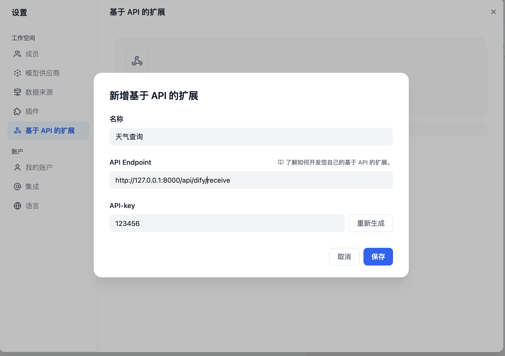
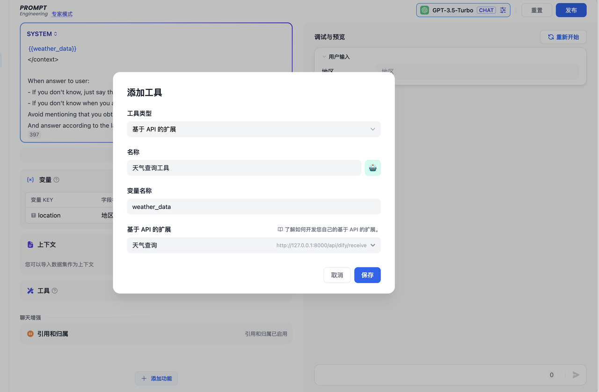

# API-based Extension

开发者可通过 API 扩展模块能力，当前支持以下模块扩展：

- `moderation` 敏感内容审计 [敏感内容审查 moderation](./moderation.md) 
- `external_data_tool` 外部数据工具 [外部数据工具 external_data_tool](./external_data_tool.md) 

在扩展模块能力之前，您需要准备一个 API 和用于鉴权的 API Key（也可由 Dify 自动生成，可选）。

除了需要开发对应的模块能力，还需要遵照以下规范，以便 Dify 正确调用 API。

## API 规范

Dify 将会以以下规范调用您的接口：

```
POST {Your-API-Endpoint}
```

### Header

| Header          | Value            | Desc                                                         |
| --------------- | ---------------- | ------------------------------------------------------------ |
| `Content-Type`  | application/json | 请求内容为 JSON 格式。                                       |
| `Authorization` | Bearer {api_key} | API Key 以 Token 令牌的方式传输，您需要解析该 `api_key` 并确认是否和提供的 API Key 一致，保证接口安全。 |

### Request Body

```JSON
{
    "point":  string, //  扩展点，不同模块可能包含多个扩展点
    "params": {
        ...  // 各模块扩展点传入参数
    }
}
```

### API 返回

```JSON
{
    ...  // API 返回的内容，不同扩展点返回见不同模块的规范设计
}
```

## 校验

在 Dify 配置 API-based Extension 时，Dify 将会发送一个请求至 API Endpoint，以检验 API 的可用性。

当 API Endpoint 接收到 `point=ping` 时，接口应返回 `result=pong`，具体如下：

### Header

```JSON
Content-Type: application/json
Authorization: Bearer {api_key}
```

### Request Body

```JSON
{
    "point": "ping"
}
```

### API 期望返回

```JSON
{
    "result": "pong"
}
```

## 范例

此处以外部数据工具为例，场景为根据地区获取外部天气信息作为上下文。

### API 范例

```
POST https://fake-domain.com/api/dify/receive
```

#### Header

```JSON
Content-Type: application/json
Authorization: Bearer 123456
```

#### Request Body

```JSON
{
    "point": "app.external_data_tool.query",
    "params": {
        "app_id": "61248ab4-1125-45be-ae32-0ce91334d021",
        "tool_variable": "weather_retrieve",
        "inputs": {
            "location": "London"
        },
        "query": "How's the weather today?"
    }
}
```

#### API 返回

```JSON
{
    "result": "City: London\nTemperature: 10°C\nRealFeel®: 8°C\nAir Quality: Poor\nWind Direction: ENE\nWind Speed: 8 km/h\nWind Gusts: 14 km/h\nPrecipitation: Light rain"
}
```

### 代码范例

代码基于 Python FastAPI 框架。

1. 安装依赖

      ```Bash
      pip install fastapi[all] uvicorn
      ```

2. 按照接口规范编写代码

      ```Python
      from fastapi import FastAPI, Body, HTTPException, Header
      from pydantic import BaseModel
      
      app = FastAPI()
      
      
      class InputData(BaseModel):
          point: str
          params: dict
      
      
      @app.post("/api/dify/receive")
      async def dify_receive(data: InputData = Body(...), authorization: str = Header(None)):
          """
          Receive API query data from Dify.
          """
          expected_api_key = "123456"  # TODO Your API key of this API
          auth_scheme, _, api_key = authorization.partition(' ')
      
          if auth_scheme.lower() != "bearer" or api_key != expected_api_key:
              raise HTTPException(status_code=401, detail="Unauthorized")
      
          point = data.point
      
          # for debug
          print(f"point: {point}")
      
          if point == "ping":
              return {
                  "result": "pong"
              }
          if point == "app.external_data_tool.query":
              return handle_app_external_data_tool_query(params=data.params)
          # elif point == "{point name}":
              # TODO other point implementation here
      
          raise HTTPException(status_code=400, detail="Not implemented")
      
      
      def handle_app_external_data_tool_query(params: dict):
          app_id = params.get("app_id")
          tool_variable = params.get("tool_variable")
          inputs = params.get("inputs")
          query = params.get("query")
      
          # for debug
          print(f"app_id: {app_id}")
          print(f"tool_variable: {tool_variable}")
          print(f"inputs: {inputs}")
          print(f"query: {query}")
      
          # TODO your external data tool query implementation here, 
          #  return must be a dict with key "result", and the value is the query result
          if inputs.get("location") == "London":
              return {
                  "result": "City: London\nTemperature: 10°C\nRealFeel®: 8°C\nAir Quality: Poor\nWind Direction: ENE\nWind "
                            "Speed: 8 km/h\nWind Gusts: 14 km/h\nPrecipitation: Light rain"
              }
          else:
              return {"result": "Unknown city"}
      ```

3. 启动 API 服务，默认端口为 8000，API 完整地址为：`http://127.0.0.1:8000/api/dify/receive`，配置的 API Key 为 `123456`。

      ```Bash
      uvicorn main:app --reload
      ```
   
4. 在 Dify 配置该 API。
<figure><figcaption></figcaption></figure>

5. 在 App 中选择该 API 扩展。
<figure><figcaption></figcaption></figure>

App 调试时，Dify 将请求配置的 API，并发送以下内容（范例）：

```JSON
{
    "point": "app.external_data_tool.query",
    "params": {
        "app_id": "61248ab4-1125-45be-ae32-0ce91334d021",
        "tool_variable": "weather_retrieve",
        "inputs": {
            "location": "London"
        },
        "query": "How's the weather today?"
    }
}
```

API 返回为：

```JSON
{
    "result": "City: London\nTemperature: 10°C\nRealFeel®: 8°C\nAir Quality: Poor\nWind Direction: ENE\nWind Speed: 8 km/h\nWind Gusts: 14 km/h\nPrecipitation: Light rain"
}
```